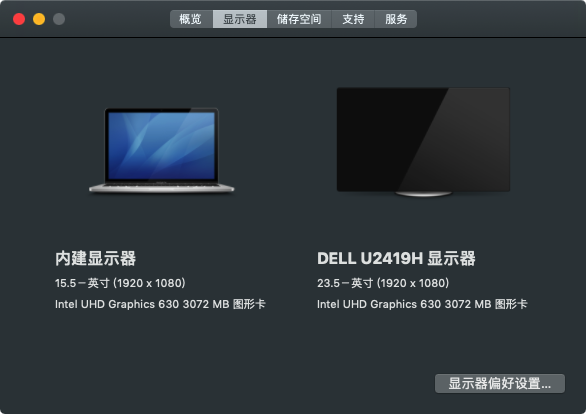

### Z7-CT7NA 黑苹果

1. 适配程度达99%，个人认为很完美。

2. 盒盖长时间后会死机器，不影响使用。

   

### 简介

1. 支持minidp口

   

1. 触控板

   

2. 电源

   

   

3. 声音

   

   

4. 网络

   自带无限网卡无解，替换成DW1560网卡后完美。

   

   > 如何添加驱动，搜索 黑苹果DW1560 安装
   > 删除USB网卡图标：进入/Library/Application Support/WLAN/ 删除 StatusBarApp.app这个文件即可

   

### 总结

```PHP
该配置使用与10.14.5，其他版本未测试，个人感觉十分完美。
不足:睡眠不能使用，触控板操作恶心。
```

